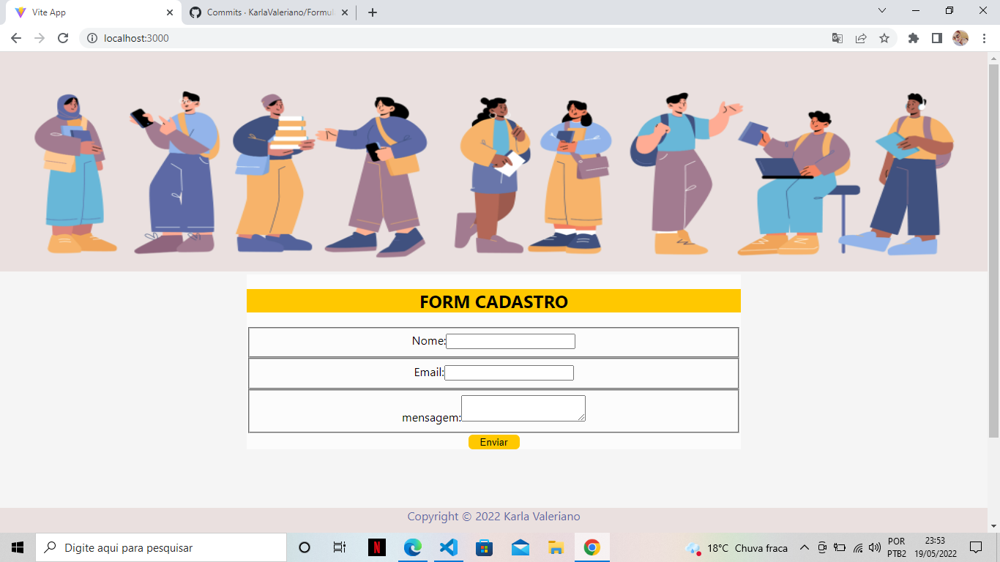

# Formulario-React
 
Criando um formulário de inscrição usando React que tem o comportamento padrão do HTML.
 
 No formulario pede nome,email,mensagem e um botão de 'enviar'.
 
Abaixo segue a imagem da página:
 
 
 